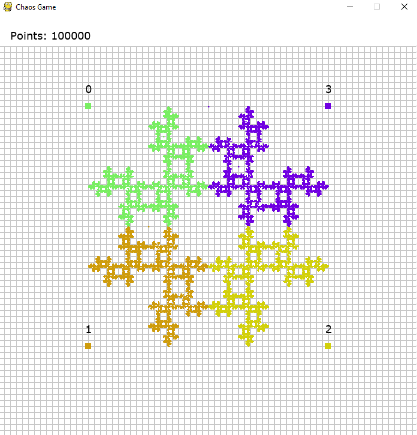
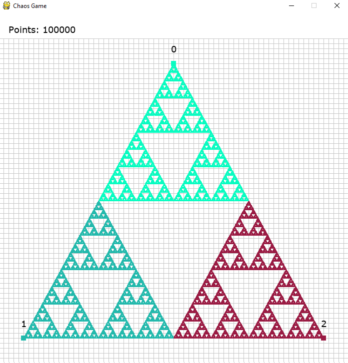
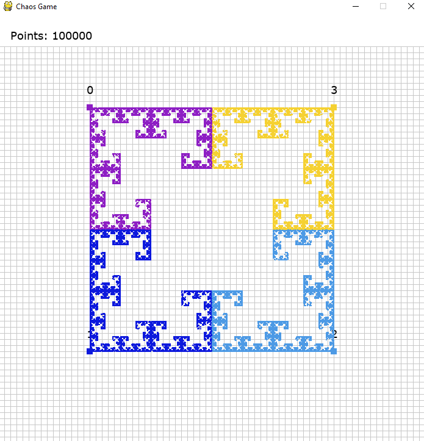

  
  
  

## :computer: Projeto

Em matemática, o termo "Chaos Game" se referia originalmente a um método de criação de um fractal, usando um polígono e um ponto inicial selecionado aleatoriamente dentro dele.

### :heavy_check_mark: Requisitos 

Para conseguir executar o projeto será necessário o uso das seguintes bibliotecas:

- pygame
- random
  
### :rocket: Tecnologias

- <a href="https://www.python.org/downloads/release/python-381/">Python 3.8.1</a>

  

### Utilização :mega:

1. Será necessário comentar / descomentar os pontos desejados no código
2. Ao entrar na pasta em que o projeto se encontra, apenas execute o comando `python chaos.py` 

---

  

